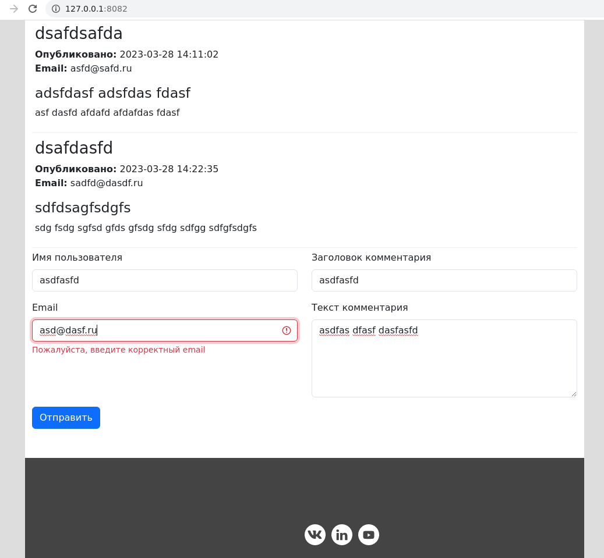

# Тестовое задание для andata.ru

Используются библиотеки:

- php
    - gabordemooij/redbean - для работы с БД
    - league/url - для работы url параметрами
- css
    - bootstrap 5
- js
    - vue 2.7

## Комментарии

- в нейминге функций и переменных используется венгерская нотация для более быстрого аутокомплита и поиска
- сделан используя наработки https://github.com/hightemp/wapp_framework
- на разработку потрачено 10 часов
- нет предела совершенству...

